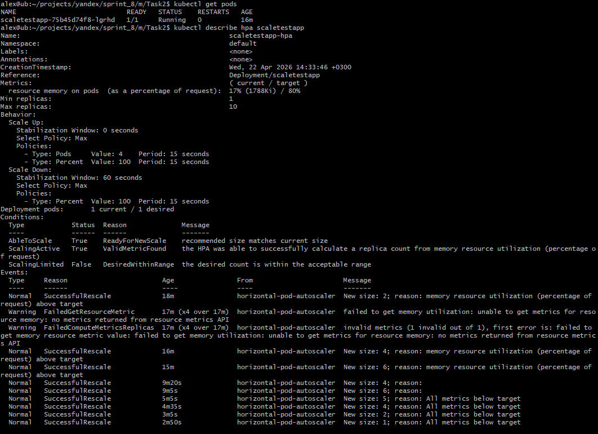
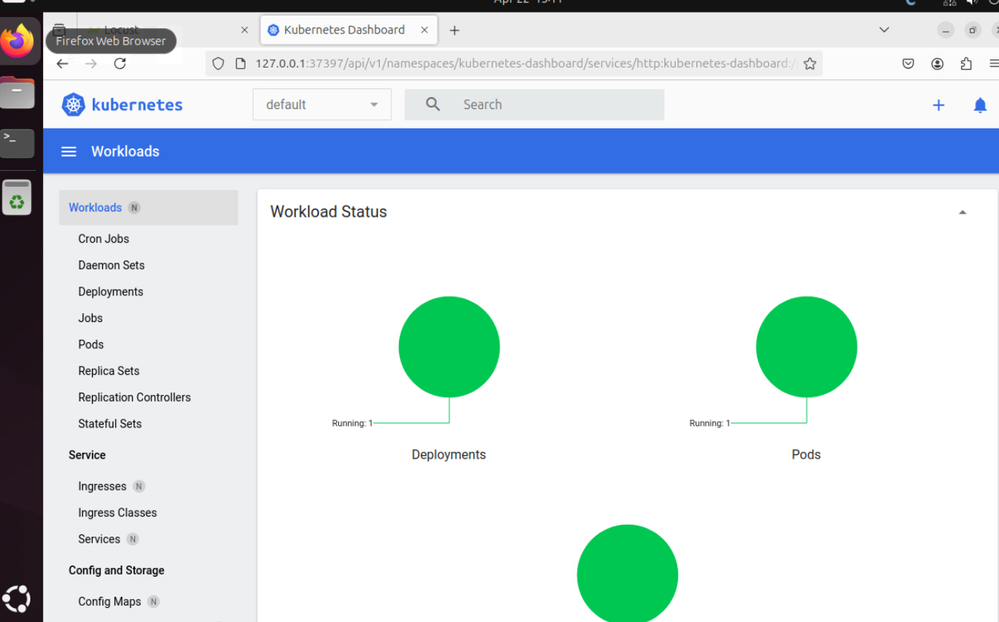
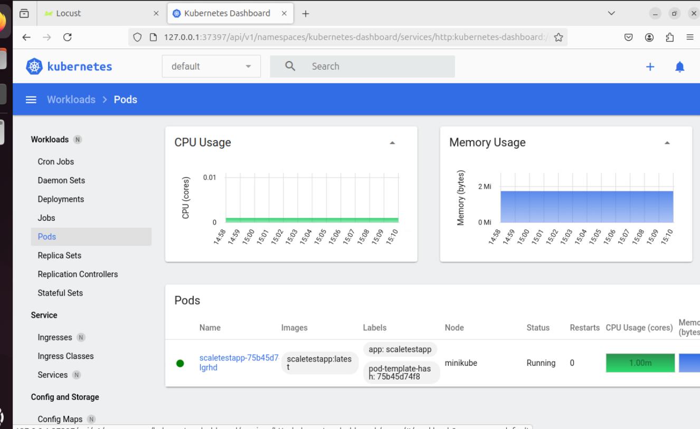
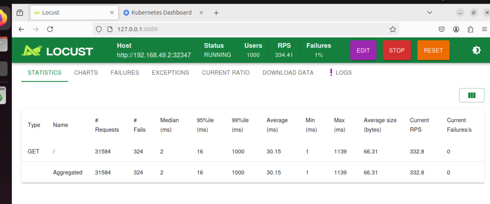
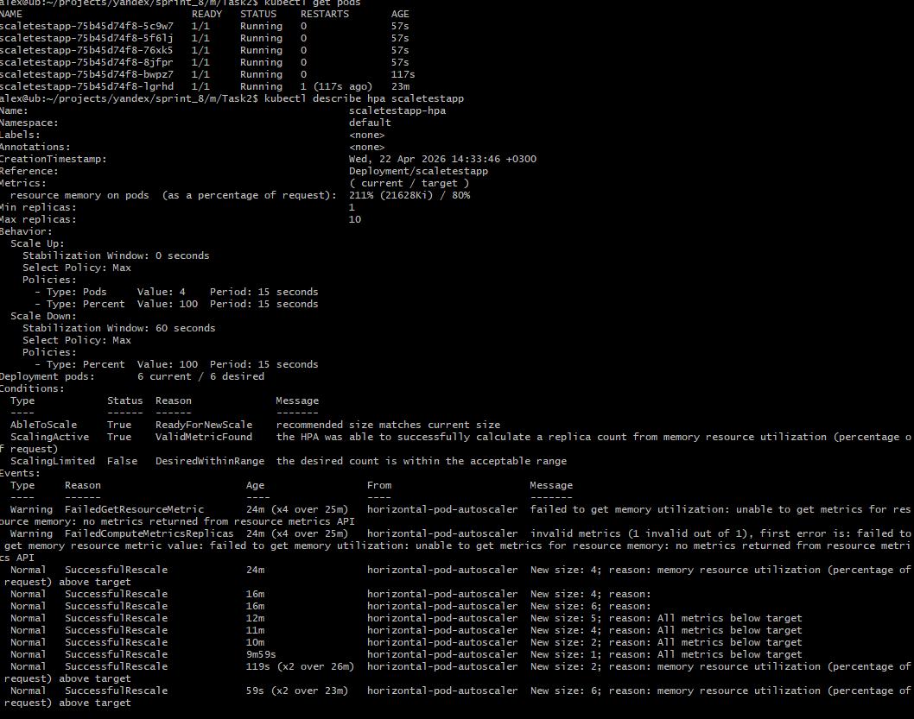
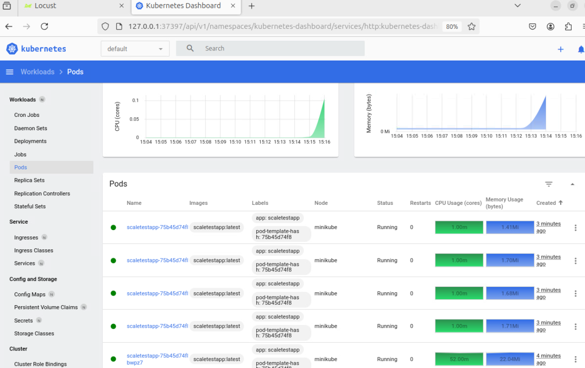

#  Задание 2. Динамическое масштабирование контейнеров

Выполнено горизонтальное масштабирование приложения по памяти.  
- Лимит памяти пода **30Mi**.  
- target memory utilization: `80%`;
- minReplicas: `1`;
- maxReplicas: `10`.

## Состояние деплоймента до нагрузки
Изначально запущена одна реплика сервиса.  
  

  

  

## Locust - создание нагрузки
  

## Состояние деплоймента во время нагрузки
В результате нагрузки приложение масштабируется до 6 подов.  
  

  

## Файлы задания
- `deployment.yaml` — Deployment приложения.
- `service.yaml` — Service (NodePort).
- `hpa.yaml` — HorizontalPodAutoscaler.
- `locust/locustfile.py` — сценарий нагрузки.
