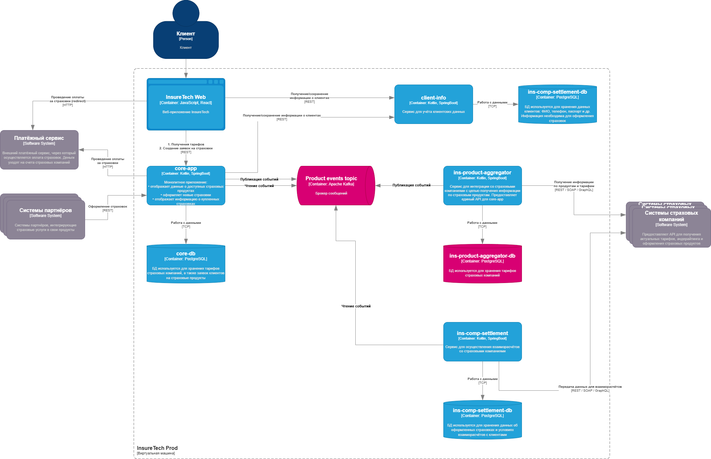

## Текущая ситуация:
Сервисы core-app и ins-comp-settlement получают данные о доступных продуктах через REST API сервиса ins-product-aggregator. В момент вызова он:  
- запрашивает информацию из всех страховых компаний (сейчас их пять),
- агрегирует её в единый список,
- возвращает этот список в рамках того же синхронного запроса.  
Чтобы ускорить работу сервисов, при изначальном проектировании команда решила хранить локальные реплики данных о продуктах и тарифах в сервисах core-app и ins-comp-settlement.  
Сервис core-app осуществляет запрос к ins-product-aggregator раз в 15 минут, а ins-comp-settlement — раз в сутки (ночью), при формировании реестра оформленных страховок. Иногда команда сталкивается с ошибками взаимодействия между этими сервисами. Они связаны с задержками ответов или ошибками при взаимодействии с API страховых компаний.  
Дополнительно сервис ins-comp-settlement раз в сутки осуществляет запрос в core-app по REST API для получения всех оформленных за день страховок. Эти данные он использует.  
В ближайшее время InsureTech планирует подписать агентское соглашение ещё с пятью страховыми компаниями. Вам предстоит спроектировать решение, которое устранит текущие проблемы.  

## Проблемы:
- Сервис ins-product-aggregator испытывает проблемы при получении данных из внешних систем. Сервисы core-app и ins-comp-settlement, работающие с ним синхронно обретают эти же проблемы.
- Сервис ins-comp-settlement раз в сутки осуществляет запрос в core-app - возможно, это достаточно большая нагрузка.

## Предлагаемое решение:
- Применить event source к сервису ins-product-aggregator, чтобы сохранялось в БД состояние с данными внешних страховых компаний.
- Изменения в данных будет передаваться асинхронно через брокер сообщений.
- Для взаимодействия ins-comp-settlement и core-app хорошо подойдёт Transactional Outbox: core-app записывает оформленную страховку к себе в БД, а также отправляет сообщение в топик брокера, на которое подписан ins-comp-settlement.
- Перевести часть внутренних REST-взаимодействий на событийную модель. Асинхронными должны стать следующие взаимодействия:
    ins-product-aggregator -> core-app  
    ins-product-aggregator -> ins-comp-settlement  
    core-app -> ins-comp-settlement  

## C4-диаграмма контейнеров

