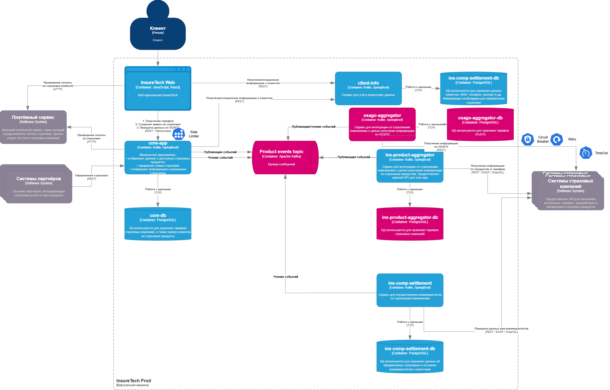

# Task4 - Проектирование продажи ОСАГО

## Изменения в диаграмме

В диаграмму из `Task3` добавлен сценарий онлайн-оформления ОСАГО.

В схеме отражены:
- контейнер с сервисом `osago-aggregator`;
- контейнер с БД `osago-aggregator-db`;
- асинхронный обмен между `core-app` и `osago-aggregator` через брокер событий;
- потоковая передача предложений в веб-приложение через `Websocket`;
- паттерны отказоустойчивости на вызовах к API страховых компаний;
- Rate Limit для клиентов;

## Принятые решения

### 1. Реализация `osago-aggregator`

`osago-aggregator` выделен в отдельный сервис, который:
- создаёт заявки ОСАГО во внешних API страховых компаний;
- хранит соответствия между внутренней заявкой и внешними `requestId`;
- публикует частичные результаты по мере поступления;
- публикует финальный статус по завершению расчёта или по истечении таймаута.

### 2. Собственное хранилище для сервиса ОСАГО

Причины:
- процесс расчёта длится до 60 секунд и не должен жить только в памяти пода;
- сервис развернут в нескольких экземплярах, поэтому состояние должно быть общим;
- нужно хранить correlation id, внешние `requestId`, статусы polling, дедлайны и результаты;
- нужно поддерживать повторную обработку и идемпотентность;
- для публикации событий безопаснее использовать `Transactional Outbox`.

### 3. API `osago-aggregator` <-> `core-app`

Для `core-app` выбран не REST API, а асинхронный событийный контракт:
- `core-app` публикует команду расчёта ОСАГО;
- `osago-aggregator` подписывается на эту команду;
- `osago-aggregator` публикует события с частичными предложениями;
- `core-app` подписывается на события и обновляет своё состояние.

Это лучше соответствует требованию показывать предложения сразу по мере поступления и не завязывает решение на конкретный экземпляр сервиса.

### 4. Средство интеграции между `core-app` и `osago-aggregator`

Используется брокер событий.

Причины:
- нужен асинхронный обмен;
- нужны частичные результаты;
- нужно устойчивое поведение при нескольких репликах;
- нужно убрать жёсткую связность между сервисами во время выполнения.

### 5. API для веб-приложения

Для веб-приложения выбрана комбинация:
- `REST` для старта расчёта ОСАГО;
- `Websocket` для доставки предложений в браузер по мере поступления.

### 6. Средство интеграции между веб-приложением и `core-app`

Используются два канала:
- `REST` для создания заявки;
- `Websocket` для стриминга предложений ОСАГО.

### 7. Паттерны отказоустойчивости

Паттерны применяются на исходящих REST-вызовах `osago-aggregator -> API страховых компаний`.

Используются:
- `Rate Limiting` для ограничения давления со стороны клиентов.
- `Circuit Breaker` для быстрого отсечения деградировавших страховых интеграций.
- `Retry` для кратковременных сетевых и временных ошибок.
- `Timeout` для ограничения времени отдельного вызова и общего жизненного цикла расчёта.

Дополнительно введён общий дедлайн: 60 секунд на сбор предложений по заявке ОСАГО.

### 8. Влияние нескольких экземпляров сервисов

Решение специально не зависит от конкретной реплики:
- состояние расчёта хранится в БД `osago-aggregator-db`;
- обмен между сервисами идёт через брокер;
- `core-app` получает результаты асинхронно и может отдавать их в веб независимо от того, какой экземпляр принял исходный запрос.

